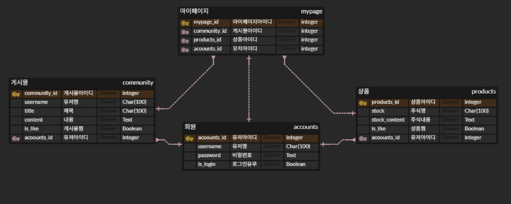

# 첫 적금 메이트

사회초년생의 첫 적금 선택을 돕는 스마트 금융 파트너

---

## 향후 개선 방향

- [미결] 코사인 유사도 검색
- [해결] 데이터베이스 학습: 기능별 테이블 정리 - 목록 생성시 새로운 테이블로 관리 요망
- [미결] 도커연습 - 이후 colab에서 한 거 도커로 작업할 예정

---

## 프로젝트 개요

- **프로젝트명**: 첫 적금 메이트 JJuns
- **설명**: 사회초년생을 타겟으로 AI 기반 예·적금 상품 추천을 제공하는 금융 서비스
- **기간**: 2025.12.19. ~ 2025.12.26.
- **보완기간**: 2026.02.25. ~

---

### 문제 상황

- 상품이 너무 많아 선택이 어려움
- 우대조건, 가입채널, 적립방식 등 조건이 복잡
- 개인 상황에 따라 유리한 상품이 달라 비교가 번거로움

### 타겟 사용자

- 사회초년생 (첫 월급, 첫 저축)
- 금융 용어와 상품 구조가 익숙하지 않은 사용자
- “뭐가 좋은지 모르겠어요” 단계의 사용자

---

## ERD



---

<br />

## 🏗️기술 스택

### Backend

&nbsp;
&nbsp;
&nbsp;

### Frontend

&nbsp;

### DevOps

&nbsp;
&nbsp;

### Tools

&nbsp;
&nbsp;

<br />

---

## 📁 프로젝트 폴더 구조

### Backend (Django)

```
backend
├─ accounts
├─ community
├─ products
└─ project
```

### Frontend (Vue.js)

```
frontend
├─ public
└─ src
    ├─ assets
    ├─ components
    ├─ router
    ├─ stores
    └─ views
        ├─ community
        ├─ youtube
        └─ etc
```

---

## 기능

1. 회원가입 및 로그인, 로그아웃 기능
2. 게시글 작성 기능
3. 게시글 및 상품 찜 기능
4. AI 상품 추천

- 사용자 입력을 임베딩하여 상품 벡터와 유사도 계산
- 코사인 유사도 기반 상위 3개 상품 추천
- 추천 상품별 최고 우대 금리 제공
- `prefetch_related`를 활용한 DB 성능 최적화

 <br>
`back\products\management\commands\get_deposit_products.py` <br>
`back\products\views.py\recommend`

---

## 학습 내용

- Django REST Framework와 Vue.js 연동 구조 이해
- 프론트엔드–백엔드 데이터 흐름 설계 경험
- LOCAL KNOWLEDGE BASE:외부 의존성을 최소화하고 로컬 연산

---

## 💡 느낀 점/ 보완 점

1. 로컬 연산으로 처리 속도 확보.
   - prefetch_related가 없었다면 발생했을 비효율을 계산해 보면 차이가 명확합니다.
   - 미사용: 38번의 DB 통신 ;
     - 상품 목록 조회 1번 + 각 상품의 금리를 찾기 위한 개별 조회 37번
   - 사용: 2번의 DB 통신 ; 상품 목록 조회 1번 + 모든 금리 옵션 일괄 조회 1번

   - [결론] : DB 서버와 통신할 때 네트워크 시간이 걸립니다. 또는 네트워크 문제로 외부 데이터를 가져올 때 시간지연의 애로사항이 있습니다. 이 횟수를 줄이는 것 만으로도 성능이 향상되고 처리 속도가 빨라집니다

2. 데이터 청킹 보완 필요.
   - 청킹은 긴 텍스트를 AI가 이해하기 좋은 '의미 단위'로 나누는 과정이나, 해당 부분에서 더블체크를 놓쳤습니다. views.py에서 유사도를 계산할 때 로그를 찍어보며 청킹의 필요성을 느껴보려 합니다. 혹은 테스트를 통해서 결과를 비교하는 과정도 방법입니다. 다만, 현재 deposit 임베딩 데이터는 상품정보의 우대조건을 다뤘기에 데이터의 질의 부분에서 어느정도 확보가 된 상태라고 생각합니다.
