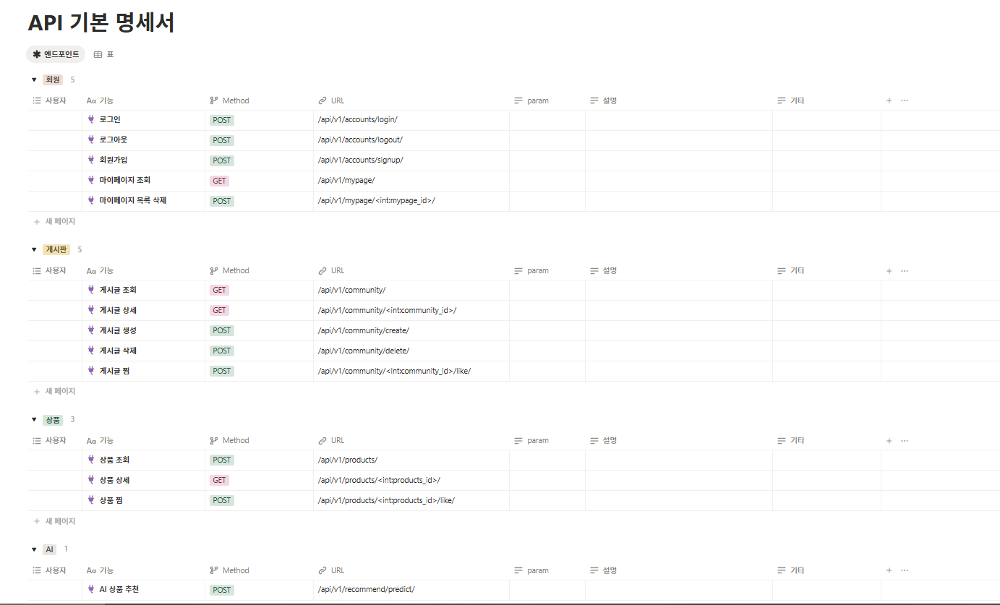

# Finance Project

# 백엔드 : app_folder에서 urls, models, serializer, views 순

# 프론트는 전체 리팩토링 예정. back 기능 다 되면 그때 과업시작

## 인수인계

```
개인대출 관련 유사도 검색해서 제안할 것
```

---

## 향후 개선 방향

- [미결] 코사인 유사도 검색
- [로컬] 데이터베이스 학습: 도커연습(miniconda포함) 기능별 테이블 정리 - 목록 생성시 새로운 테이블로 관리 요망
- [로컬] 도커연습 - 이후 colab에서 한 거 도커로 작업할 예정

---

## 프로젝트 개요

- **프로젝트명**: 개인대출 상품 제안
- **설명**: AI 기반 상품 동향을 검토하고 의사결정을 지원하는 금융 서비스
- **기간**: 2025.12.19. ~ 2025.12.26.
- **보완기간**: 2026.02.25. ~

---

### 문제 상황

- 상품이 많아 선택이 어려움 : TOP 3 select 지원

### 타겟 사용자

- 개인대출 사용자

---

## [미완] API명세서



## [미완] ERD


---

<br />

## 🏗️기술 스택

### Backend

&nbsp;
&nbsp;
&nbsp;

### Frontend

&nbsp;

### DevOps

&nbsp;
&nbsp;

### Tools

&nbsp;
&nbsp;
&nbsp;

<br />

---

## [미완] 프로젝트 폴더 구조

project
├── front/ # Vue
├── back/ # Django
├── ai-server/ # FastAPI + PyTorch/TensorFlow
│ ├── main.py
│ ├── requirements.txt
│ └── models/ # .gitignore에 등록 ([미완]허깅페이스 링크)
└── README.md # 전체 프로젝트 실행 가이드

---

## 기능

1. AI 상품 추천

- 사용자 입력을 임베딩하여 상품 벡터와 유사도 계산
- 코사인 유사도 기반 상위 3개 상품 추천
- 추천 상품별 최고 우대 금리 제공
- `prefetch_related`를 활용한 DB 성능 최적화

 <br>
`back\products\management\commands\get_deposit_products.py` <br>
`back\products\views.py\recommend`

---

## 학습 내용

- LOCAL KNOWLEDGE BASE:외부 의존성을 최소화하고 로컬 연산

---

## 💡 느낀 점/ 보완 점

- 개인상품은 요건이 명확하다. 소득이나 신용점수가 있다. 그리고 담보대출도 주택에 치중되어 있어서 정형화된 패턴을 보인다.
